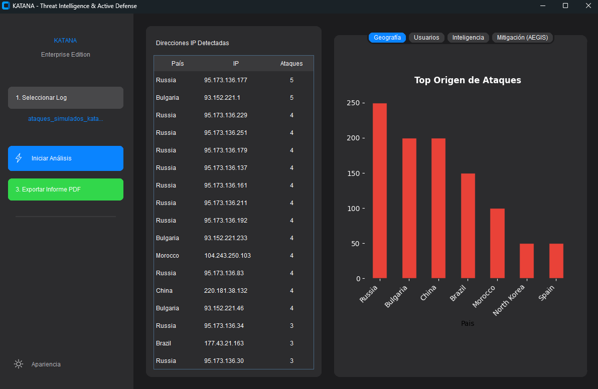
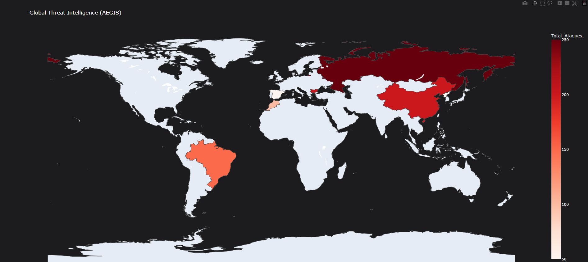
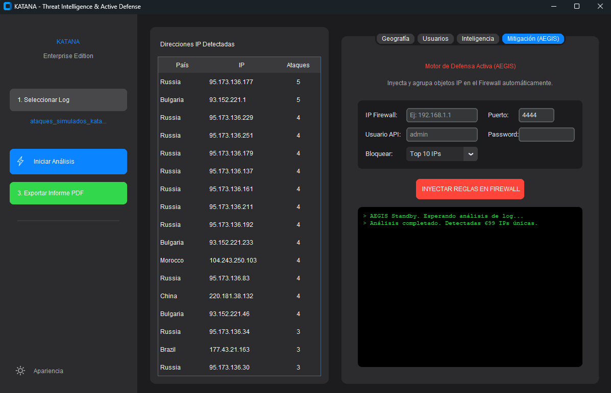

<p align="center">
  
</p>

<h1 align="center">⚔️ KATANA v3.0</h1>
<h3 align="center">Threat Intelligence & Active Defense Platform</h3>

<p align="center">
Advanced SOC Analysis Tool for Sophos Firewall Logs
</p>

<p align="center">


</p>

---

# ⚔️ KATANA v3.0 — Threat Intelligence & Active Defense

KATANA is a **Threat Intelligence and Active Defense platform** designed for **SOC analysts, incident responders and cybersecurity researchers**.

The tool analyzes **Sophos Firewall logs**, extracts attacker intelligence, visualizes attack patterns, and can **actively mitigate threats by blocking attackers directly via the Sophos Firewall API**.

KATANA bridges the gap between:

• 🔎 Forensic Log Analysis
• 📊 Threat Intelligence Visualization
• 🛡️ Automated Active Defense

---

# 🚀 Core Capabilities

KATANA combines **log forensics**, **threat intelligence**, and **automated defense** into a single desktop platform.

---

# 🔍 Threat Intelligence Engine

Parses raw firewall logs and extracts attack intelligence.

### Features

• Sophos CSV log parsing
• Attacker IP extraction
• Username brute-force detection
• Attack frequency analysis
• Targeted account identification

---

# 🌍 Global Threat Mapping

Visualize attacks geographically.

Powered by:

* Pandas
* Plotly
* Matplotlib

Includes:

• Top attacking countries
• Global heatmap
• Attack distribution charts
• Interactive world visualization

---

# 🛡️ AEGIS Active Defense Engine

AEGIS allows **direct mitigation of malicious IP addresses** through the **Sophos Firewall API**.

### Capabilities

• Direct Sophos Firewall API integration
• Automated malicious IP blocking
• Real-time mitigation console
• Bulk attacker injection

### Blocking Modes

* Top 10 attackers
* Top 50 attackers
* Top 100 attackers

---

# 🖥️ Application Interface

## Dashboard



## Threat Map



## AEGIS Console



---

# 📦 Installation

Clone the repository:

```bash
git clone https://github.com/yourusername/katana-threat-analyzer.git
cd katana-threat-analyzer
```

Install dependencies:

```bash
pip install -r requirements.txt
```

---

# ⚙️ Sophos Firewall Configuration

To allow KATANA to interact with the firewall:

1. Login to **Sophos WebAdmin**
2. Navigate to:

```
Administration → Device Access
```

3. Enable:

```
API Configuration
```

4. Add the **IP address of the machine running KATANA** to the allowed list.

---

# 🧱 Build Portable Executable

You can compile KATANA into a **single portable Windows executable**.

```bash
pyinstaller --noconfirm --onefile --windowed --name "KATANA_v3.0_Ultimate" katana.py
```

Note:

Large libraries such as **Pandas** and **Plotly** are bundled, so the first launch may take several seconds.

---

# 🛠️ Technology Stack

| Component       | Technology          |
| --------------- | ------------------- |
| Language        | Python              |
| GUI             | CustomTkinter       |
| Data Processing | Pandas              |
| Visualization   | Matplotlib / Plotly |
| Networking      | Sophos Firewall API |

---

# 🎯 Use Cases

KATANA can be used for:

• SOC investigations
• Firewall brute-force detection
• Threat intelligence analysis
• Incident response
• Security monitoring
• Automated attacker blocking

---

# ⚠️ Disclaimer

The **AEGIS Engine performs direct modifications to firewall configurations**.

Use responsibly.

The authors are **not responsible for network outages, firewall misconfigurations, or unintended blocks** caused by automated mitigation.

Always test in a **controlled environment** before production use.

---

# 📜 License

MIT License

---

# 👨‍💻 Author

Cybersecurity Research Project

Focus areas:

Threat Intelligence
Defensive Security
Security Automation
